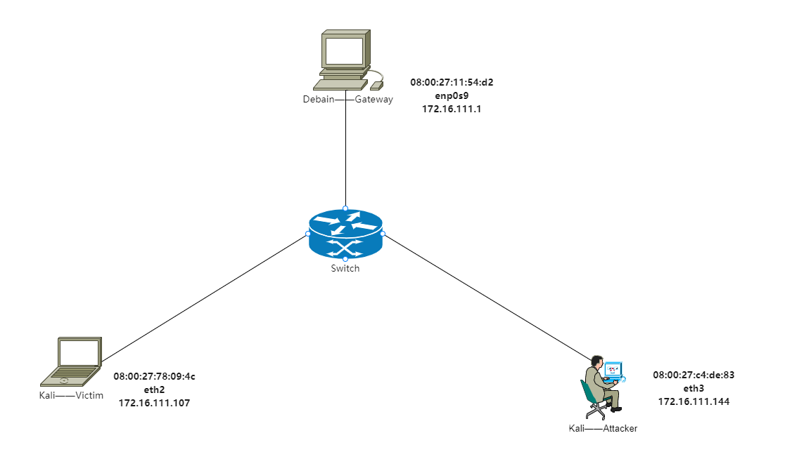

# 基于 Scapy 编写端口扫描器

## 实验目的

- 掌握网络扫描之端口状态探测的基本原理

## 实验环境

- python 3.9.2
- scapy 2.4.4
- nmap 7.91
- Kali Rolling (Linux kali 5.18.0-kali5-amd64)

## 实验要求

- 禁止探测互联网上的 IP ，严格遵守网络安全相关法律法规
- 完成以下扫描技术的编程实现
  -  `TCP connect scan`/ `TCP stealth scan`
  -  `TCP Xmas scan` / `TCP fin scan`/ `TCP null scan`
  -  `UDP scan`
-  上述每种扫描技术的实现测试均需要测试端口状态为：开放、关闭 和 过滤 状态时的程序执行结果
-  提供每一次扫描测试的抓包结果并分析与课本中的扫描方法原理是否相符？如果不同，试分析原因；
-  在实验报告中详细说明实验网络环境拓扑、被测试 IP 的端口状态是如何模拟的
-  复刻 nmap 的上述扫描技术实现的命令行参数开关

## 实验过程

### 网络拓扑



使用类似第四节实验的拓扑结构，Attacker作为扫描端，Victim作为被扫描的靶机。

### 端口状态模拟

- 查看当前防火墙的状态和现有规则

```shell
ufw status
```

- 关闭状态

  ：对应端口没有开启监听, 防火墙没有开启。

  ```shell
  ufw disable
  ```

- 开启状态

  ：对应端口开启监听: apache2基于TCP, 在80端口提供服务; DNS服务基于UDP,在53端口提供服务。防火墙处于关闭状态。

  ```shell
  systemctl start apache2 # port 80
  systemctl start dnsmasq # port 53
  ```

- 过滤状态

  ：对应端口开启监听, 防火墙开启。

  ```shell
  ufw enable && ufw deny 80/tcp
  ufw enable && ufw deny 53/udp
  ```

### TCP connect scan

> 先发送一个S，然后等待回应。如果有回应且标识为RA，说明目标端口处于关闭状态；如果有回应且标识为SA，说明目标端口处于开放状态。这时TCP connect scan会回复一个RA，在完成三次握手的同时断开连接.

**code**

```python
from scapy.all import *


def tcpconnect(dst_ip, dst_port, timeout=10):
    pkts = sr1(IP(dst=dst_ip)/TCP(dport=dst_port,flags="S"),timeout=timeout)
    if pkts is None:
        print("Filtered")
    elif(pkts.haslayer(TCP)):
        if(pkts.getlayer(TCP).flags == 0x12):  #Flags: 0x012 (SYN, ACK)
            send_rst = sr(IP(dst=dst_ip)/TCP(dport=dst_port,flags="AR"),timeout=timeout)
            print("Open")
        elif (pkts.getlayer(TCP).flags == 0x14):   #Flags: 0x014 (RST, ACK)
            print("Closed")

tcpconnect('172.16.111.144', 80)
```

**nmap**

```shell
nmap -sT -p 80 172.16.111.144
```

#### 端口关闭：

​                                            

​                                                                                 

**nmap复刻**


#### 端口开放：


**nmap复刻**


#### 端口过滤：


**nmap复刻**：


### TCP stealth scan

> 先发送一个S，然后等待回应。如果有回应且标识为RA，说明目标端口处于关闭状态；如果有回应且标识为SA，说明目标端口处于开放状态。这时TCP stealth scan只回复一个R，不完成三次握手，直接取消建立连接。

**code**

```python
#! /usr/bin/python

from scapy.all import *


def tcpstealthscan(dst_ip, dst_port, timeout=10):
    pkts = sr1(IP(dst=dst_ip)/TCP(dport=dst_port, flags="S"), timeout=10)
    if (pkts is None):
        print("Filtered")
    elif(pkts.haslayer(TCP)):
        if(pkts.getlayer(TCP).flags == 0x12):
            send_rst = sr(IP(dst=dst_ip) /
                          TCP(dport=dst_port, flags="R"), timeout=10)
            print("Open")
        elif (pkts.getlayer(TCP).flags == 0x14):
            print("Closed")
        elif(pkts.haslayer(ICMP)):
            if(int(pkts.getlayer(ICMP).type) == 3 and int(stealth_scan_resp.getlayer(ICMP).code) in [1, 2, 3, 9, 10, 13]):
                print("Filtered")


tcpstealthscan('172.16.111.144', 80)
```

**nmap**

```shell
nmap -sS -p 80 172.16.111.144
```

#### 端口关闭：


**nmap复刻**：

​	                                     

​                                                           

#### 端口开放：


**nmap复刻**：


#### 端口过滤：


**nmap复刻**：


### TCP Xmas scan

> 一种隐蔽性扫描，当处于端口处于关闭状态时，会回复一个RST包；其余所有状态都将不回复。

**code**

```python
#! /usr/bin/python
from scapy.all import *


def Xmasscan(dst_ip, dst_port, timeout=10):
    pkts = sr1(IP(dst=dst_ip)/TCP(dport=dst_port, flags="FPU"), timeout=10)
    if (pkts is None):
        print("Open|Filtered")
    elif(pkts.haslayer(TCP)):
        if(pkts.getlayer(TCP).flags == 0x14):
            print("Closed")
    elif(pkts.haslayer(ICMP)):
        if(int(pkts.getlayer(ICMP).type) == 3 and int(pkts.getlayer(ICMP).code) in [1, 2, 3, 9, 10, 13]):
            print("Filtered")


Xmasscan('172.16.111.144', 80)
```

**nmap**

```shell
nmap -sX -p 80 172.16.111.144
```

#### 端口关闭：


​                                           

**nmap复刻**：


#### 端口开放：


**nmap复刻**：


#### 端口过滤：


**nmap复刻**：


### TCP FIN scan

> 仅发送FIN包，FIN数据包能够通过只监测SYN包的包过滤器，隐蔽性较SYN扫描更⾼，此扫描与Xmas扫描也较为相似，只是发送的包未FIN包，同理，收到RST包说明端口处于关闭状态；反之说明为开启/过滤状态。

**code**

```python
#! /usr/bin/python
from scapy.all import *


def finscan(dst_ip, dst_port, timeout=10):
    pkts = sr1(IP(dst=dst_ip)/TCP(dport=dst_port, flags="F"), timeout=10)
    if (pkts is None):
        print("Open|Filtered")
    elif(pkts.haslayer(TCP)):
        if(pkts.getlayer(TCP).flags == 0x14):
            print("Closed")
    elif(pkts.haslayer(ICMP)):
        if(int(pkts.getlayer(ICMP).type) == 3 and int(pkts.getlayer(ICMP).code) in [1, 2, 3, 9, 10, 13]):
            print("Filtered")


finscan('172.16.111.144', 80)
```

**nmap**

```shell
nmap -sF -p 80 172.16.111.144
```

#### 端口关闭：

​                                            

​                                           

**nmap复刻**：


#### 端口开放：


**nmap复刻**：


#### 端口过滤：


**nmap复刻**：


### TCP NULL scan

> 发送的包中关闭所有TCP报⽂头标记，实验结果预期还是同理：收到RST包说明端口为关闭状态，未收到包即为开启/过滤状态.

**code**

```python
#! /usr/bin/python
from scapy.all import *


def nullscan(dst_ip, dst_port, timeout=10):
    pkts = sr1(IP(dst=dst_ip)/TCP(dport=dst_port, flags=""), timeout=10)
    if (pkts is None):
        print("Open|Filtered")
    elif(pkts.haslayer(TCP)):
        if(pkts.getlayer(TCP).flags == 0x14):
            print("Closed")
    elif(pkts.haslayer(ICMP)):
        if(int(pkts.getlayer(ICMP).type) == 3 and int(pkts.getlayer(ICMP).code) in [1, 2, 3, 9, 10, 13]):
            print("Filtered")


nullscan('172.16.111.144', 80)
```

**nmap**

```shell
nmap -sN -p 80 172.16.111.144
```

#### 端口关闭：


​                                           

**nmap复刻**：


#### 端口开放：


**nmap复刻**：


#### 端口过滤：


**nmap复刻**：


### UDP scan

> 一种开放式扫描，通过发送UDP包进行扫描。当收到UDP回复时，该端口为开启状态；否则即为关闭/过滤状态.

**code**

```python
from scapy.all import *
def udpscan(dst_ip, dst_port, dst_timeout=10):
    resp = sr1(IP(dst=dst_ip)/UDP(dport=dst_port), timeout=dst_timeout)
    if (resp is None):
        print("Open|Filtered")
    elif (resp.haslayer(UDP)):
        print("Open")
    elif(resp.haslayer(ICMP)):
        if(int(resp.getlayer(ICMP).type) == 3 and int(resp.getlayer(ICMP).code) == 3):
            print("Closed")
        elif(int(resp.getlayer(ICMP).type) == 3 and int(resp.getlayer(ICMP).code) in [1, 2, 9, 10, 13]):
            print("Filtered")
        elif(resp.haslayer(IP) and resp.getlayer(IP).proto == IP_PROTOS.udp):
            print("Open")
udpscan('172.16.111.144', 53)
```

**nmap**

```shell
nmap -sU -p 53 172.16.111.144
```

#### 端口关闭：


​                                           

**nmap复刻**：


#### 端口开放：


**nmap复刻**：


#### 端口过滤：


**nmap复刻**：


## 实验总结、遇到的问题及解决方案

**1.扫描方式与端口状态的对应关系**

| 扫描方式/端口状态             | 开放                            | 关闭            | 过滤            |
| ----------------------------- | ------------------------------- | --------------- | --------------- |
| TCP connect / TCP stealth     | 完整的三次握手，能抓到ACK&RST包 | 只收到一个RST包 | 收不到任何TCP包 |
| TCP Xmas / TCP FIN / TCP NULL | 收不到TCP回复包                 | 收到一个RST包   | 收不到TCP回复包 |
| UDP                           | 收到UDP回复包                   | 收不到UDP回复包 | 收不到UDP回复包 |

**2.其他实验问题的回答**

- 提供每一次扫描测试的抓包结果并分析与课本中的扫描方法原理是否相符？如果不同，试分析原因；

  抓包以截图形式提供在每次扫描结果中。

  完全相符。看了一下[nmap文档](https://nmap.org/book/)，原理是相同的。但是实操中nmap要快很多，个人分析是python调用包的问题。

- 关于不同方法得到的端口状态不同的原因

  > 黄大：网络扫描不是一个『确定性』方法，网络协议是一个「状态机」，不同输入会产生不同的响应状态。一个开放/关闭/被过滤的端口，对于不同的输入按照协议设计和实现，自然会有不同的预定义响应方法。同一种协议设计，也会有不同的协议实现，这些也会导致不同协议栈实现的服务器即使收到相同的packet，也会回应不同的 packet。所以，所谓『得到不同的状态结果』这句话是一个病句，缺少主语。补全之后是：网络扫描算法『根据目标端口的响应行为』**推断**这个端口有不同的状态结果

**3.课后思考题回答**

- 通过本章网络扫描基本原理的学习，试推测

  - 应用程序版本信息扫描原理

    **【ANS】**

    - 通过扫描与应用程序关联的端口状态获知版本信息

    - （资料查询）

      > After TCP and/or UDP ports are discovered using one of the other scan methods, version detection interrogates those ports to determine more about what is actually running. The *nmap-service-probes* database contains probes for querying various services and match expressions to recognize and parse responses. Nmap tries to determine the service protocol (e.g. FTP, SSH, Telnet, HTTP), the application name (e.g. ISC BIND, Apache httpd, Solaris telnetd), the version number, hostname, device type (e.g. printer, router), the OS family (e.g. Windows, Linux). When possible, Nmap also gets the Common Platform Enumeration (CPE) representation of this information. Sometimes miscellaneous details like whether an X server is open to connections, the SSH protocol version, or the KaZaA user name, are available. Of course, most services don't provide all of this information. If Nmap was compiled with OpenSSL support, it will connect to SSL servers to deduce the service listening behind that encryption layer. Some UDP ports are left in the `open|filtered` state after a UDP port scan is unable to determine whether the port is open or filtered. Version detection will try to elicit a response from these ports (just as it does with open ports), and change the state to open if it succeeds. `open|filtered` TCP ports are treated the same way.

  - 网络漏洞扫描原理

    **【ANS】**

    - 通过扫描与网络服务关联的端口状态获知有关目标主机的信息

    - （资料查询）

      > 网络安全漏洞扫描技术是一种基于Internet远程检测目标网络或本地主机安全性脆弱点的技术。包括：PING扫射（Ping sweep）、操作系统探测（Operating system identification）、如何探测访问控制规则（firewalking）、端口扫描（Port scan）以及漏洞扫描（vulnerability scan）等。
      >
      > 通过网络安全漏洞扫描，系统管理员能够发现所维护的Web服务器的各种TCP/IP端口的分配、开放的服务、Web服务软件版本和这些服务及软件呈现在Internet上的安全漏洞。网络安全漏洞扫描技术也是采用积极的、非破坏性的办法来检验系统是否有可能被攻击崩溃。其利用了一系列的脚本模拟对系统进行攻击的行为，并对结果进行分析。这种技术通常被用来进行模拟攻击实验和安全审计。
      >
      > 一次完整的网络安全漏洞扫描分为三个阶段：
      >
      > 1. 发现目标主机或网络；
      > 2. 发现目标后进一步搜集目标信息，包括操作系统类型、运行的服务以及服务软件的版本等。如果目标是一个网络，还可以进一步发现该网络的拓扑结构、路由设备以及各主机的信息；
      > 3. 根据搜集到的信息判断或者进一步测试系统是否存在安全漏洞。

- 网络扫描知识库的构建方法有哪些？

  **【ANS】** 只搜索到了与「网络安全知识图谱」有关的内容…或许可以提供一下相关的英文名称便于查询？

- 除了 nmap 之外，目前还有哪些流行的网络扫描器？和 nmap 进行优缺点对比分析

  **【ANS】**

  - 网络扫描器
    - Advanced Port Scanner
    - GFI LanGuard
    - PortScan&Stuff
    - Nagios
    - MiTeC’s Network Scanner
    - OpenNMS
    - Capsa Free Network Analyzer
    - PRTG Network Monitor Freeware
    - The Dude
    - Xirrus Wi-Fi Inspector

## 参考资料

- [【推荐阅读】TCP常见的扫描类型](https://blog.51cto.com/professor/1701977)
- [Guide: Using Scapy with Python](https://santanderglobaltech.com/en/guide-using-scapy-with-python/)
- [Port Scanning using Scapy](https://resources.infosecinstitute.com/port-scanning-using-scapy/)
- [TCP Connect Scan (-sT) | Nmap Network Scanning](https://nmap.org/book/scan-methods-connect-scan.html)
- [TCP SYN (Stealth) Scan (-sS) | Nmap Network Scanning](https://nmap.org/book/synscan.html)
- [TCP FIN, NULL, and Xmas Scans (-sF, -sN, -sX) | Nmap Network Scanning](https://nmap.org/book/scan-methods-null-fin-xmas-scan.html)
- [TCP UDP Scan (-sU) | Nmap Network Scanning](https://nmap.org/book/scan-methods-udp-scan.html)
- [【示例代码】xuanhun/PythonHackingBook1](https://github.com/xuanhun/PythonHackingBook1/blob/1d495637af2b344094e322f34a7ae4d6deae0605/3.7 端口扫描/code/portScan.py)
- [argparse --- 命令行选项、参数和子命令解析器](https://docs.python.org/zh-cn/3/library/argparse.html#argparse.ArgumentParser)
- [Linux下scapy运行时报错：No module named scapy](https://www.jianshu.com/p/0967710a3b9f)
