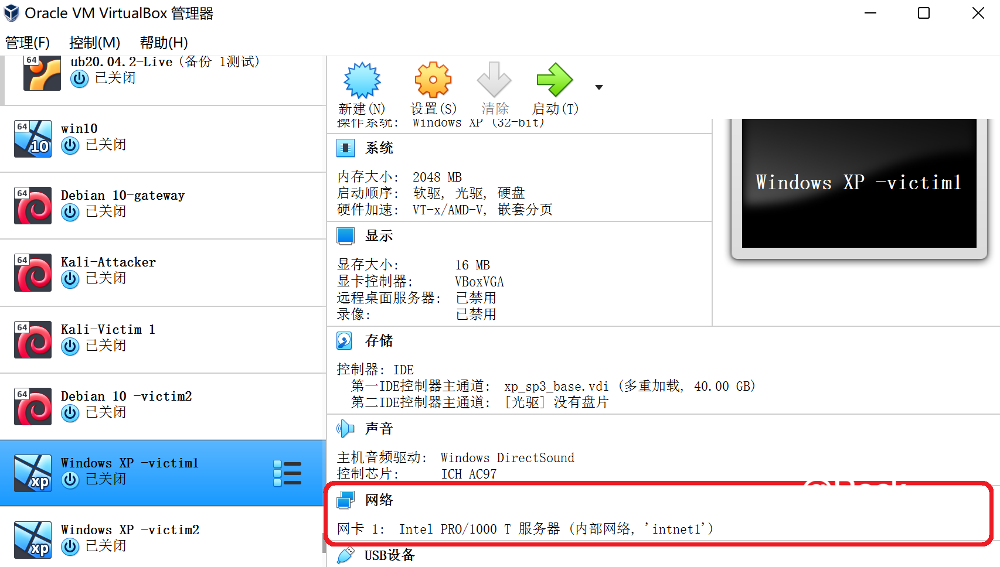

# 💻基于 VirtualBox 的网络攻防基础环境搭建

## 实验目的

- 掌握 VirtualBox 虚拟机的安装与使用；
- 掌握 VirtualBox 的虚拟网络类型和按需配置；
- 掌握 VirtualBox 的虚拟硬盘多重加载；

## 实验环境

本次实验需要使用的网络节点说明：

- VirtualBox 虚拟机
- 攻击者主机（Attacker）：Kali
- 网关（Gateway, GW）：Debian
- 靶机（Victim）：Debian / xp-sp3 / Kali

## 实验要求

- 虚拟硬盘配置成多重加载
- 搭建满足如下拓扑图所示的虚拟机网络拓扑；
- 

- 完成以下网络连通性测试；
  - 靶机可以直接访问攻击者主机
  - 攻击者主机无法直接访问靶机
  - 网关可以直接访问攻击者主机和靶机
  - 靶机的所有对外上下行流量必须经过网关
  - 所有节点均可以访问互联网

### 1.配置虚拟硬盘多重加载

- VirtualBox虚拟机管理 -> 虚拟介质管理
- 选中所需的虚拟盘，将属性 -> 类型 修改为多重加载


信息如下：


### 2.搭建虚拟机网络拓扑

#### 配置拓扑所需网络

**网关**需四块网卡

- NAT网络，使网关可访问攻击者主机；
- 仅主机（Host-Only）网络，进行网卡设置；
- 内部网络intnet1，搭建局域网1；
- 内部网络intnet2，搭建局域网2。


**攻击者**需三块网卡

- NAT网络;
- 两块不同的Host-Only.


**victim**都需一块网卡

- 内部网络，使不同组的victim在不同局域网内;
- victim-xp-1 与 victim-kali-1 在同一局域网内（intnet1）； victim-xp2 与 victim-debian-2 在同一局域网内（intnet2）



如下：


### 3.连通性测试

| 节点               | ip地址         | MAC地址           |
| ------------------ | -------------- | ----------------- |
| Kali-Attacker      | 10.0.2.15      | 08:00:27:49:1b:10 |
| Kali-Victim1       | 172.16.111.104 | 08:00:27:3d:72:99 |
| Windows XP-Victim1 | 169.254.5.249  | 08:00:27:B8:08:32 |
| Debian10-Victim2   | 172.16.222.100 | 08:00:27:02:8e:3c |
| Windows XP-Victim2 | 169.254.3.136  | 08:00:27:2C:D0:E0 |

#### 3.1靶机可以直接访问攻击者主机

> 网关使用了NAT模式。本实验中，靶机ping攻击者，ICMP Echo Request在经过网关时，网关会将src ip改为自己的外网IP。攻击者发回的ICMP Echo Reply在经过网关时，src ip又会被网关转换攻击者的IP，所以靶机看就是“能ping通攻击者”

- **局域网1内靶机可直接访问攻击者主机**


- **局域网2内靶机可直接访问攻击者主机**


#### 3.2攻击者主机无法直接访问靶机

> 靶机在内部局域网中使用的是虚拟ip地址，即仅内部网络可用的地址，除本局域网以外的机器访问是无效的，因此，攻击者无法对其进行访问。

- **攻击者无法直接访问局域网1内的靶机**


- **攻击者无法直接访问语句网2内的靶机**


#### 3.3网关可以直接访问攻击者主机和靶机

- **网关访问攻击者主机**


- **网关访问局域网1内靶机**


- **网关访问局域网2内靶机**


#### 3.4靶机的所有对外上下行流量必须经过网关

> 靶机对外上网需通过网关获取mac地址，再根据指定的ip地址进行转发包。

- 靶机与互联网互通的过程中**用网关抓包，若靶机发送的所有包都能被网关抓到**，说明靶机的所有对外上下行流量必须经过网关。
  - 清空靶机ARP缓存及DNS缓存
  - 靶机与互联网互通：
  - 网关抓包 1.直接使用tcpdump：`sudo tcpdump -c 5`
- **局域网1内的靶机**


- **局域网2内的靶机**


- **利用tmux将抓包数据文件复制到主机用WireShark分析**

```shell
# 安装tcpdump
apt install tcpdump
apt update && apt install tmux

# 抓包
cd workspace
tcpdump -i enp0s9 -n -w 20210908.1.pcap
```


抓包后的文件通过scp传送到本地在wireshark中进行分析，发现对应的ip数据均符合靶机和目标网址等信息，证明靶机的所有上过流量必须经过网关。


#### 3.5所有节点均可以访问互联网

- **网关可正常访问互联网**


- **局域网1内的靶机可正常访问互联网**


**局域网2内的靶机可正常访问互联网**


- **攻击者可正常访问互联网**


## 问题与解决方案

- **kali域名无法暂时解析 无法连接网络**

  在配置Kali Attack主机中，报错“无法解析域名”，然后查看网卡，发现没有地址，然后换了阿里的清华的东软的源发现都不可以。

  

  同时无法解析域名：

  

  **解决方案**：

  然后使用下面两个命令获取地址：

  ```powershell
  ifconfig eth0 up
  dhclient eth0
  ```

  随后又使用：

  ```shell
  apt update
  ```

  使用下面命令下载安装签名：

  ```shell
  wget archive.kali.org/archive-key.asc   
  //下载签名
   
  apt-key add archive-key.asc   
  //安装签名
  ```

  随后就可以正常使用了：

  

- **如何配置两块不同的Host-only网卡**

  管理->主机网络管理器->创建一个新的host-only网卡并启用DHCP服务


- **攻击者kali的host-only网络初始时未分配ip地址**

  解决方案：修改配置文件 。添加以下信息，将`eth1`和`eth2`这两块网卡修改为**开机自启动**，并且**写入dhcp服务**从而动态获取路由分配的ip。

  ```shell
  sudo vim /etc/network/interfaces
  
  auto eth1 
  iface eth1 inet dhcp #配置eth1使用DHCP协议
  auto eth2
  iface eth2 inet dhcp #配置eth2使用DHCP协议
  
  # 重启网卡，右上角会出现断开网络的图标
  /etc/init.d/network-manager restart
  ```

## 参考资料

- [The solution for selecting the NAT network as the virtualbox network connection method, cannot specify the interface name](https://blog.csdn.net/hexf9632/article/details/110197530)
- [Kali's network settings and three network modes](https://www.codenong.com/cs109191978/)
- [安装kali系统 apt-get update报“无法解析域名”错误](https://blog.csdn.net/zhanghaoranjn/article/details/100543666?spm=1001.2101.3001.6650.11&utm_medium=distribute.pc_relevant.none-task-blog-2%7Edefault%7EOPENSEARCH%7ERate-11-100543666-blog-115233528.pc_relevant_aa&depth_1-utm_source=distribute.pc_relevant.none-task-blog-2%7Edefault%7EOPENSEARCH%7ERate-11-100543666-blog-115233528.pc_relevant_aa&utm_relevant_index=14)

