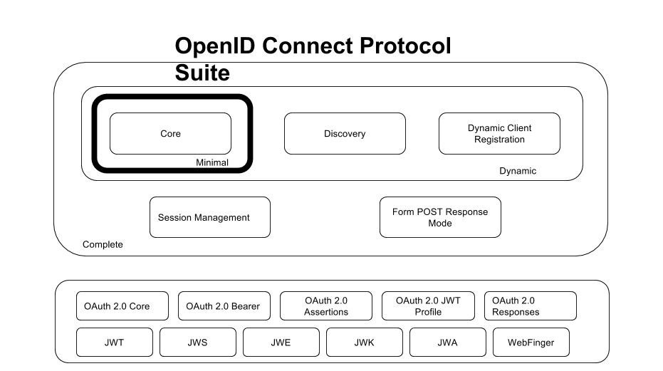

# 💻操作系统的访问控制设计实例研究

## 实验目的

- 通过 iOS 或Android 系统为研究对象，进行访问控制的理解和设计

## 实验环境

- 操作系统版本:HarmonyOS 2.0.0
- 硬件设备型号:Honor 30 Pro 
- 是否默认设置:是

## 实验结果

- 以 HarmonyOS 系统为研究对象
  - 当系统处于锁屏状态下接收到新短信时，不解锁情况下
    - 系统是否允许查看短信内容？ **否**
    - 系统是否允许回复短信？**否**
    - 安卓上的 App : 以 ***畅连*** 为例，在接管了系统短信功能和权限之后，是否会有一些不同的功能设定？
    - 
  - 当系统处于锁屏状态下，使用系统内置（例如 iOS 的 Siri ）或第三方的语音助手可以完成以下哪些操作？
    - 访问通讯录 ：**不能**
    - 拨打电话：**能**
    - 访问相册：**不能**
    - 查看短信收件箱：**不能**
  
  - 实验并分析指纹识别相比较于简单密码、复杂密码、图形解锁、人脸识别解锁、声纹解锁等解锁方式的安全性、便利性差异。
  
    - | 密码类型     | 安全性                                                       | 便利性                                                 |
      | ------------ | ------------------------------------------------------------ | ------------------------------------------------------ |
      | 简单密码     | 一般情况下指纹解锁的安全性是高于简单密码，因为简单密码被暴力破解的可能性较大，而伪造指纹的各方面成本更高。 | 容易记住，比较方便。                                   |
      | 复杂密码     | 分析破解更不容易，但是安全性还是没有指纹高。                 | 输入较为麻烦，记忆也不方便。                           |
      | 图形解锁     | 简单的图形密码也容易被暴力破解。并且图形密码和简单密码容易被偷窥而破解。 | 解锁需要画图，相较指纹不容易。                         |
      | 人脸识别解锁 | 人脸识别主要是特征识别，安全性在特征唯一的情况下可以保证，人脸识别的准确率受到许多外部因素的影响，而且人脸本身也会发生一些改变，不排除使用高质量照片解锁的可能性，但如今一些品牌的高端旗舰款会搭载3D人脸识别，提高人脸解锁安全性。 | 方便，只需要人脸对着摄像头即可，但是可能受光线的影响。 |
      | 声纹解锁     | 人脸识别相似，对外界环境因素的影响很敏感，而且如果使用者声音发生变化（如感冒等），就大大影响了声纹解锁的准确率。 | 需要说话，在安静的环境不方便。                         |
      | 指纹解锁     | 如人脸识别可能用照片绕过，声纹识别可能被录音绕过，指纹解锁的破译=获取使用者的指纹，而使用者可以在各种地方留下指纹，但复制指纹需要一定的技术手段，且具有身份的唯一标识性。 | 比较方便，手指一按就解锁，但是有时候手湿会影响准确性。 |
  
- 思考题：
  
  - 以上设计实现方式属于我们课堂上讲过的哪种强制访问控制模型？Lattice/BLP？Biba？
  
    Biba模型，可以上读下写，锁屏时只能读短信，属于**上读**；解开屏幕以后，可以回复短信，属于**下写**。
  
  - 系统或第三方应用程序是否提供了上述功能的访问控制规则修改？如果修改默认配置，是提高了安全性还是降低了安全性？
  
    是，例如上面的**畅连**，可以修改权限。如果随意修改默认配置，会赋予App应用不同的权限，其中包括位置信息、通讯录、信息等多个敏感权限：
  
    
  
    
  
    
  
    通过对不同App应用赋予不同的权限控制从而实现不同层级的安全性控制。

## 课后思考题

#### 1.生物特征身份认证方式有哪些？优缺点分析？应用场景举例。

- **指纹识别(Fingerprint recognition)**

  - 优点
    1. 识别速度最快，应用最方便
    2. 推广容易、应用最为广泛、适应能力强
    3. 误判率和拒真率低：指纹是人体独一无无二的特征，并且它们的复杂度足以提供用于鉴别的足够特征
    4. 稳定性和可靠性强：如果要增加可靠性，只需登记更多的指纹、鉴别更多的手指，最多可以多达十个，而每一个指纹都是独一无二的
    5. 易操作，无需特殊培训既可使用
    6. 安全性强，系统扫描对身体无害
    7. 指纹具备再生性
    8. 可持续的发展性：指纹采集头可以更加小型化，并且价格会更加的低廉
  - 缺点
    1. 对环境的要求很高，对手指的湿度、清洁度等都很敏感，脏、油、水都会造成识别不了或影响到识别的结果
    2. 某些人或某些群体的指纹特征少，甚至无指纹，所以难以成像
    3. 对于脱皮、有伤痕等低质量指纹存在识别困难、识别率低的问题，对于一些手上老茧较多的体力劳动者等部分特殊人群的注册和识别困难较大
    4. 每一次使用指纹时都会在指纹采集头上留下用户的指纹印痕，而这些指纹痕迹存在被用来复制指纹的可能性
    5. 指纹识别时的操作规范要求较高
    6. 数据在存储时不存储任何含有指纹图像的数据，而只是存储从指纹中得到的加密的指纹特征数据
  - 应用场景
    1. 计算机网络安全：在计算机上将指纹识别与传统身份认证相结合，防止密码忘记或被别人窃取时产生的安全威胁
    2. 金融机构银行等机构进行员工身份认证、自动取款机客户的身份认证、移动支付的安全认证等
    3. 政府机关、企事业单位：主要用于对管理人员进行授权和身份认证、考勤、安全区域员工身份验证，数据库访问安全控制等方面
    4. 教育、医疗、司法机构学校通过门禁控制对学生及工作人员进行身份认证；医院等对私人信息的安全认证，使最终用户能够安全方便的查询和验证相关手续、病人和捐赠者的鉴定，防止欺诈性捐助等；公安司法机关利用指纹验证解决方案，快速有效的鉴别危险罪犯，以保障公民安全
    5. 边境控制，机场、港口出入境人员护照、签证等上的身份认证，以及边境检查中进行“黑名单”筛查等

- **虹膜识别(iris recognition)**

  - 优点
    1. 便于用户使用
    2. 虹膜信息无法复制
    3. 不需物理的接触
    4. 可靠性高
  - 缺点
    1. 难以将图像获取设备小型化
    2. 设备造价高，无法大范围推广
    3. 镜头可能产生图像畸变而使可靠性降低
    4. 一个自动虹膜识别系统包含硬件和软件两大模块：虹膜图像获取装置和虹膜识别算法。分别对应于图像获取和模式匹配这两个基本问题
    5. 没有经过任何的测试，当前的虹膜识别系统只是用统计学原理进行了小规模的试验，而没有经过现实世界的唯一性认证的试验
    6. 极难读取黑眼睛信息
    7. 需要较好的光源
  - 应用场景
    1. 门禁考勤：扫描虹膜就能实现通道控制、开/锁门的和考勤管理，虹膜考勤识别迅速，无需接触，不能被假冒和替代打卡
    2. 煤炭行业：虹膜识别技术最初就大量应用在煤炭行业，这是由煤炭行业工种的特殊性和工作环境所决定的——工人面部、指纹等其他生物特征容易受到损毁和破坏而导致辨识不清
    3. 金融机构
    4. 社保生存认证：虹膜识别养老金发放中的生存认证系统具有独特性、不可替代性、防假冒和生物活性等特性，可以准确无误的掌握生存人数，解决养老金发放中的异地验证问题及冒领、冒用甚至骗保等社保难题，有效提高了办事效率，防止错误发生
    5. 司法安检：在司法、公安、军队等系统中，警察滥用枪支时有发生，因此针对此问题推出了基于虹膜识别技术的智能枪弹柜管控系统，成效明显；在监狱，搭载虹膜识别技术的双门互锁门禁系统被广泛应用，有效防止越狱事件的发生，另外，犯人在出、入狱时候的身份认证，均采用的是识别最精准的虹膜技术，否则一不小心关错人或者放错人，就会酿成大错
    6. 教育考试：由于作弊手段日趋高科技化，反作弊技术也在日益提升。为了从根本上杜绝以上不良现象的发生，有多家考场推出了虹膜识别技术，来认证考生的身份，这种技术也用于新生报道，杜绝冒名顶替的事情发生
    7. 网络安全：借助虹膜技术提供互联网保护，确保用户登陆、计算机、在线交易及信息安全，如微软的Windows10用虹膜识别代替密码登录

- **视网膜识别(Retina recognition)**

  - 优点
    1. 视网膜是一种极其固定的生物特征，不磨损、不老化、不受疾病影响
    2. 使用者无需和设备直接接触
    3. 是最难欺骗的系统，因为视网膜不可见，所以不会被伪造
  - 缺点
    1. 未经测试
    2. 激光照射眼球的背面可能会影响使用者健康，需要进行进一步的研究
    3. 对消费者而言视网膜技术没有吸引力
    4. 很难进一步降低成本
  - 应用场景 视网膜识别技术是一种非主流的生物识别产品

- **面部识别(face recognition)**

  - 优点 用户无需和设备直接接触

  - 缺点

    1. 只有比较高级的摄像头才可以有效高速地捕捉面部图像
    2. 使用者面部的位置与周围的光环境可能影响系统的精确性
    3. 容易被欺骗
    4. 面部识别技术的改进有赖于提取特征与比对技术的提高，采集图像的设备比技术昂贵得多
    5. 对于因人体面部的如头发、食物、自然老化以及其他的变化需要通过人工智能补偿，机器学习功能必须不断地将以前得到的图像和现在得到的进行对比，以改进核心数据并弥补微小的差别
    6. 很难进一步降低成本，必须以昂贵的费用去购买高质量的设备

  - 应用场景

    1. 人脸检测

       a. 人脸属性识别：可以通过图像快速建立客户画像数据库并进行大数据画像，从而实现精准营销

       b. 人脸特征定位：对于识别出来的人脸图像区域的五官进行精准定位，得到图片中人脸五官的坐标和特征值。产品应用上最主流的是社交的常用产品图片美颜和娱乐类换脸

    2. 人脸比对：目前发展到可以实现视频流和图片的比对，以及多种传感器所传入的脸部信号的比对

       a. 人脸检索：将输入的人脸与数据库中的人脸进行比对，确定输入的人脸是否属于特定角色的身份验证，在人脸闸机、会员刷脸识别等领域得到应用

       b. Face ID：目前人脸检索技术最知名的是苹果的Face ID，Face ID通过多种传感器实现3D头部建模并存储在手机中，每次登陆解锁都通过多种传感器绘制3D图像与存储的模型进行人脸比对，从而实现登录和解锁。据宣传重合率可以达到百万分之一的级别

    3. 活体检测：判断操作用户是否为真人，抵御照片、视频、模具等作弊攻击。目前技术上分为静态活体检测和动态活体检测，应用较多的是动态活体检测

       a. 静态活体检测：判断静态图片是真实的客户行为还是二次翻拍，一般用在防攻击不高的场景中

       b. 动态活体检测：通过指示用户做出行为，验证用户是否为真实活体本人操作

    4. 人脸核身：指通过用户的一段自拍视频或一张自拍照，与公民身份信息库里的高清证件照，进行1:1人脸验证确认用户身份，并通过活体检测来确认当前用户是否为本人和真人。人脸核身的产品应用相当广泛，每年一次的对社保参保人员的身份校验、互联网借贷系统的实名认证、互联网保险销售的实名认证、银行/证券的远程开户等等

- **签名识别(Signature recognition)**

  - 优点 容易被大众接受，是一种公认的身份识别技术
  - 缺点
    1. 随经验的增长、性情的变化生活方式的改变，签名也会随之改变
    2. 在网络上使用不方便
    3. 用于签名的手写板结构复杂且价格昂贵，笔记本和电脑的触摸板的分辨率差异很大，在技术上将两者结合起来较困难
    4. 很难将设备尺寸小型化
  - 应用场景
    1. 上课签到
    2. 借条、合同等重要文件签名防抵赖

- **声音识别(voice recognition)**

  - 优点
    1. 非接触的识别技术
    2. 用户容易接受
  - 缺点
    1. 声音的变化范围大，难以精确匹配
    2. 声音会随着音量、速度和音质的变化而影响到采集与对比的结果
    3. 容易实现欺骗
    4. 高保真的麦克风很昂贵
  - 应用场景
    1. 电子声控
    2. 语音拨号
    3. 语音监听
    4. 语音导航
    5. 即时翻译

#### 2.“找回口令功能”和“忘记密码”在访问授权机制中的意义？请尝试设计几种安全的“找回口令功能”，详细描述找回口令的用户具体操作过程。

- 增加了系统的可用性，若无此功能则用户忘记登陆口令就代表着该账户下存储的数据在客户端永久丢失、在服务提供商端永久不能访问
- “找回口令”功能设计
  - **通过注册账户时填写的邮箱找回密码**
    1. 用户端发起找回密码申请，填写丢失口令的帐号（二次确认）与动态验证码（防止机器操作）
    2. 确认用户存在后，验证用户找回账户时使用的邮箱与注册账户使用的用户是否一致；若一致则继续，若重复输入三次依然不一致则24h内不允许该账户再次进入找回密码流程
    3. 向用户邮箱发送重置密码链接，用户从邮箱点开链接即可重置密码
  - **通过注册账户时填写的关联账户找回密码**
    1. 用户端发起找回密码申请，填写丢失口令的帐号（二次确认）与动态验证码（防止机器操作）
    2. 确认用户存在后，向用户申请账户时设置的关联账号（家人/亲友/自己账户）邮箱发送确认信息
    3. 待所有用户全部确认后向用户邮箱发送重置密码链接，用户从邮箱点开链接即可重置密码
  - **通过注册账户时填写的手机号找回密码**
    1. 用户端发起找回密码申请，填写丢失口令的帐号（二次确认）与动态验证码（防止机器操作）
    2. 确认用户存在后，向用户申请账户时填写的手机号发送6-8位动态验证码
    3. 用户在找回密码页面填写动态验证码后，即可充值账户密码
  - **通过Face ID找回密码**
    1. 用户端发起找回密码申请，填写丢失口令的帐号（二次确认）与动态验证码（防止机器操作）
    2. 确认用户存在后，使用PC前置摄像头录入用户面容，确认为用户本人后即可进入重置密码流程

#### 3.绘制用户使用用户名/口令+图片验证码方式录系统的流程图。考虑认证成功和失败两种场景，考虑授权成功和失败两种场景。

#### 4.Windows XP / 7 中的访问控制策略有哪些？访问控制机制有哪些？

- 访问控制策略

  1. 基于角色的访问控制
  2. 强制访问控制
  3. 自主访问控制

- 访问控制机制

  1. **C2-level Security**

     > - It must be possible to control access to a resource by granting or denying access to individual users or named groups of users
     > - Memory must be protected so that its contents cannot be read after a process frees it. Similarly, a secure file system, such as NTFS, must protect deleted files from being read
     > - Users must identify themselves in a unique manner, such as by password, when they log on. All auditable actions must identify the user performing the action
     > - System administrators must be able to audit security-related events. However, access to the security-related events audit data must be limited to authorized administrators
     > - The system must be protected from external interference or tampering, such as modification of the running system or of system files stored on disk

  2. **Access Control Model**

     > - Two basic parts of the access control model
     >
     >   1. **Access tokens: ** which contain information about a logged-on user
     >   2. **Security descriptors: ** which contain the security information that protects a securable object
     >
     > - DACLs (discretionary access control list) and ACEs (access control entries)
     >
     >   **About *NULL*: ** If the DACL that belongs to an object's security descriptor is set to NULL, a null DACL is created. A null DACL grants full access to any user that requests it; normal security checking is not performed with respect to the object. A null DACL should not be confused with an empty DACL. An empty DACL is a properly allocated and initialized DACL that contains no ACEs. An empty DACL grants no access to the object it is assigned to.
     >
     > - Interaction Between Threads and Securable Objects
     >
     >   
     >
     > - Anonymous access is allowed

  3. **Privileges**

     > - Privileges control access to system resources and system-related tasks, whereas access rights control access to securable objects.
     > - A system administrator assigns privileges to user and group accounts, whereas the system grants or denies access to a securable object based on the access rights granted in the ACEs in the object's DACL.

  4. **Audit Generation**

     > - The security descriptor for a securable object can have a system access control list (SACL). A SACL contains access control entries (ACEs) that specify the types of access attempts that generate audit reports. Each ACE identifies a trustee, a set of access rights, and a set of flags that indicate whether the system generates audit messages for failed access attempts, successful access attempts, or both.
     > - The system writes audit messages to the security event log.
     > - To read or write an object's SACL, a thread must first enable the SE_SECURITY_NAME privilege.
     > - The Windows API also provides support for server applications to generate audit messages when a client tries to access a private object.

  5. **Securable Objects**

     > - A securable object is an object that can have a security descriptor. All named Windows objects are securable. Some unnamed objects, such as process and thread objects, can have security descriptors too.
     > - The following table shows the functions to use to manipulate the security information for some common securable objects:
     >
     > | Object type                                                  | Security descriptor functions                                |
     > | ------------------------------------------------------------ | ------------------------------------------------------------ |
     > | Files or directories on an NTFS file system                  | **GetNamedSecurityInfo**, **SetNamedSecurityInfo**, **GetSecurityInfo**, **SetSecurityInfo** |
     > | Named pipes Anonymous pipes                                  | **GetSecurityInfo**, **SetSecurityInfo**                     |
     > | Processes Threads                                            | **GetSecurityInfo**, **SetSecurityInfo**                     |
     > | File-mapping objects                                         | **GetNamedSecurityInfo**, **SetNamedSecurityInfo**, **GetSecurityInfo**, **SetSecurityInfo** |
     > | Access tokens                                                | **SetKernelObjectSecurity**, **GetKernelObjectSecurity**     |
     > | Window-management objects (window stations and desktops)     | **GetSecurityInfo**, **SetSecurityInfo**                     |
     > | Registry keys                                                | **GetNamedSecurityInfo**, **SetNamedSecurityInfo**, **GetSecurityInfo**, **SetSecurityInfo** |
     > | Windows services                                             | **GetNamedSecurityInfo**, **SetNamedSecurityInfo**, **GetSecurityInfo**, **SetSecurityInfo** |
     > | Local or remote printers                                     | **GetNamedSecurityInfo**, **SetNamedSecurityInfo**, **GetSecurityInfo**, **SetSecurityInfo** |
     > | Network shares                                               | **GetNamedSecurityInfo**, **SetNamedSecurityInfo**, **GetSecurityInfo**, **SetSecurityInfo** |
     > | Interprocess synchronization objects (events, mutexes, semaphores, and waitable timers) | **GetNamedSecurityInfo**, **SetNamedSecurityInfo**, **GetSecurityInfo**, **SetSecurityInfo** |
     > | Job objects                                                  | **GetNamedSecurityInfo**, **SetNamedSecurityInfo**, **GetSecurityInfo**, **SetSecurityInfo** |
     > | Directory service objects                                    | These objects are handled by Active Directory Objects.       |

#### 5.用权限三角形模型来理解并描述下 2 种威胁模型：提权、仿冒。

- - 权限三角形模型：用户 - 角色（分级）- 权限（对象+操作）

  - 威胁模型描述

    - ##### 提权

      - 提权分为：水平特权提升、垂直特权提升。
      - 提权是指本来没有某项权限的用户，通过一定的方法获得该权限，简而言之，用户以自己的身份获得了本不属于自己的权限。
        - e.g.1 用户A本来只能对一个文件进行查看，但是通过提权获得了对文件修改的权利（垂直提权）。
        - e.g.2 用户A本来只能查看自己的文件，通过提权可以查看B的文件（水平提权）。
      - 提权是用户→角色→权限，角色不变，而获取的权限扩大。

      ##### 仿冒

      - 仿冒是指用户A以用户B的身份通过了认证，之后行使了B所有的权利
      - 仿冒是用户→角色，获取的角色改变，所以能够行使的权限也就因角色的改变而改变了

  

#### 6.试通过操作系统的访问控制机制来达到预防一种真实病毒的运行目的。

- 病毒名称：WannaCry

- 受影响的Windows操作系统版本：Windows Vista, Windows Server 2008, Windows 7, Windows Server 2008 R2, Windows 8.1, Windows Server 2012, Windows Server 2012 R2, Windows RT 8.1, Windows 10, Windows Server 2016, Server Core installation option

- 漏洞信息：

  当 Microsoft 服务器消息块 1.0 (SMBv1) 服务器处理某些请求时，存在一个信息泄漏漏洞。成功利用此漏洞的攻击者可能设计一个特殊的数据包，这可能导致服务器中的信息泄漏。 为了利用此漏洞，在多数情况下，未经身份验证的攻击者可能向目标 SMBv1 服务器发送经特殊设计的数据包。

  | **漏洞标题**                 | **CVE 编号**  | **已公开披露** | **已被利用** |
  | ---------------------------- | ------------- | -------------- | ------------ |
  | Windows SMB 远程代码执行漏洞 | CVE-2017-0143 | 否             | 否           |
  | Windows SMB 远程代码执行漏洞 | CVE-2017-0144 | 否             | 否           |
  | Windows SMB 远程代码执行漏洞 | CVE-2017-0145 | 否             | 否           |
  | Windows SMB 远程代码执行漏洞 | CVE-2017-0146 | 否             | 否           |
  | Windows SMB 远程代码执行漏洞 | CVE-2017-0148 | 否             | 否           |

- 可能起作用的修补漏洞方法：禁用 SMBv1

  - 对于**客户端**操作系统
    1. 打开“控制面板”，单击“程序”，然后单击“打开或关闭 Windows 功能”
    2. 在“Windows 功能”窗口中，清除“SMB 1.0/CIFS 文件共享支持”复选框，然后单击“确定”以关闭此窗口
    3. 重启系统
  - 对于**服务器**操作系统
    1. 打开“服务器管理器”，单击“管理”菜单，然后选择“删除角色和功能“
    2. 在“功能”窗口中，清除“SMB 1.0/CIFS 文件共享支持”复选框，然后单击“确定”以关闭此窗口
    3. 重启系统

#### 7.什么是 OAuth？

OAuth是一个关于授权（authorization）的开放网络标准，在全世界得到广泛应用。

- OAuth工作原理

  > OAuth在"客户端"与"服务提供商"之间，设置了一个授权层（authorization layer）。"客户端"不能直接登录"服务提供商"，只能登录授权层，以此将用户与客户端区分开来。"客户端"登录授权层所用的令牌（token），与用户的密码不同。用户可以在登录的时候，指定授权层令牌的权限范围和有效期。
  >
  > "客户端"登录授权层以后，"服务提供商"根据令牌的权限范围和有效期，向"客户端"开放用户储存的资料。

- OAuth运行流程

  

（A）用户打开客户端以后，客户端要求用户给予授权。

（B）用户同意给予客户端授权。

（C）客户端使用上一步获得的授权，向认证服务器申请令牌。

（D）认证服务器对客户端进行认证以后，确认无误，同意发放令牌。

（E）客户端使用令牌，向资源服务器申请获取资源。

（F）资源服务器确认令牌无误，同意向客户端开放资源。

OAuth协议为用户资源的授权提供了一个安全的、开放而又简易的标准。与以往的授权方式不同之处是OAuth的授权不会使第三方触及到用户的帐号信息（如用户名与密码），即第三方无需使用用户的用户名与密码就可以申请获得该用户资源的授权，因此OAuth是“安全的”。同时，任何第三方都可以使用OAuth认证服务，任何服务提供商都可以实现自身的OAuth认证服务，因而OAuth是“开放的”。

常见的授权方式是使用授权码，比如使用微信扫码/QQ登录第三方网站时会显示👇

#### 8.什么是 OpenID？

> - **Introduction**
>
>   OpenID allows you to use an existing account to sign in to multiple websites, without needing to create new passwords.
>
>   You may choose to associate information with your OpenID that can be shared with the websites you visit, such as a name or email address. With OpenID, you control how much of that information is shared with the websites you visit.
>
>   With OpenID, your password is only given to your identity provider, and that provider then confirms your identity to the websites you visit. Other than your provider, no website ever sees your password, so you don’t need to worry about an unscrupulous or insecure website compromising your identity.
>
>   OpenID is rapidly gaining adoption on the web, with over one billion OpenID enabled user accounts and over 50,000 websites accepting OpenID for logins. Several large organizations either issue or accept OpenIDs, including Google, Facebook, Yahoo!, Microsoft, AOL, MySpace, Sears, Universal Music Group, France Telecom, Novell, Sun, Telecom Italia, and many more.
>
> - **Who Owns or Controls OpenID**
>
>   OpenID was created in the summer of 2005 by an open source community trying to solve a problem that was not easily solved by other existing identity technologies. As such, OpenID is *decentralized* and *not owned by anyone*, nor should it be. Today, anyone can choose to use an OpenID or become an OpenID Provider for free without having to register or be approved by any organization.
>
>   The OpenID Foundation was formed to assist the open source model by providing a legal entity to be the steward for the community by providing needed infrastructure and generally helping to promote and support expanded adoption of OpenID.
>
> - **OpenID Connect Protocol**

OpenID是一个身份认证协议，侧重于确定“用户是谁”，即认证用户所声称的身份是否真实。

OpenID是一个去中心化的网上身份认证系统。对于支持OpenID的网站，用户不需要记住像用户名和密码这样的传统验证标记。取而代之的是，他们只需要预先在一个作为OpenID身份提供者（identity provider, IdP）的网站上注册。OpenID是去中心化的，任何网站都可以使用OpenID来作为用户登录的一种方式，任何网站也都可以作为OpenID身份提供者。

OpenID既解决了问题而又不需要依赖于中心性的网站来确认数字身份。

#### 9.试用本章所学理论分析 0Auth 和 OpenID 的区别与联系。

- OpenID只做身份认证，没有授予权限，它只实现了证明“我是我”。
- OAuth授予第三方应用访问受保护的信息的权限。
- 仅需作单纯的身份认证时没必要用到OAuth，用到第三方网站的外部服务时才需使用OAuth。

- OAuth关注的是授权（Authorization），即：“用户能做什么”
- OpenID关注的是认证（Authentication），即：“用户是谁”

| OAuth2   | OpenID                                                       |                                                              |
| -------- | ------------------------------------------------------------ | ------------------------------------------------------------ |
| 票据格式 | JSON/SAML2                                                   | JSON                                                         |
| 支持授权 | YES                                                          | NO                                                           |
| 支持认证 | 伪认证                                                       | YES                                                          |
| 创建年份 | 2005                                                         | 2006                                                         |
| 最新版本 | OAuth2                                                       | OpenID Connect                                               |
| 传输方式 | HTTP                                                         | HTTP GET and HTTP POST                                       |
| 安全弱点 | 不能抵抗网络钓鱼，OAuth没有使用数据签名和加密等措施，数据安全完全依赖TLS | 不能抵抗网络钓鱼，一个钓鱼的IDP如果恶意记录下来用户的OpenID，将会造成很严重的隐私安全问题 |
| 使用场景 | API授权                                                      | 商用应用的单点登录                                           |

- 联系

  - 两者都可以用来实现用户验证和用户授权，因为，两者本质上都是用来获取断言的方法（assertion verification method），都可以通过url重定向返回断言， 而用户身份和用户权限本质上都是断言，用户身份是关于“用户是谁”，用户权限是关于“用户可以操作什么”
  - OAuth2是OpenID-Connect的基础（在OpenID-Connect中，ID-Token也被当做是一种资源）

  

#### 10.如何使用 OAuth 和 OpenID 相关技术实现单点登录（Single Sign On）？

**单点登录 (SSO)** 是一种对于许多相互关连，但是又是各自独立的软件系统，提供访问控制的属性。当拥有这项属性时，当用户登录时，就可以获取所有系统的访问权限，不用对每个单一系统都逐一登录。

**微软账户就是一个单点登录微软账户**，使微软用户登录微软网站（如Outlook），运行在微软操作系统的设备（如Windows10电脑/平板、WindowsPhone、Xbox），微软应用软件（如Visual Stdio）。

微软的网站，服务，应用程序都可以使用同一个微软账户登录，而不需要多个账户。

也就是说，**单点登录的实现是发生在服务器之间**，如登录Outlook，用户身份的确认是由微软账户认证服务器实现，而不是Outlook服务器。

## 参考资料

- [OWASP Forgot Password Cheat Sheet](https://www.owasp.org/index.php/Forgot_Password_Cheat_Sheet)
- [Managing Authorization and Access Control](https://docs.microsoft.com/en-us/previous-versions/windows/it-pro/windows-xp/bb457115(v%3dtechnet.10))
- [Access Control (Authorization)](https://docs.microsoft.com/en-us/windows/win32/secauthz/access-control)
- [OAuth From Wikipedia](https://en.wikipedia.org/wiki/OAuth)
- [OpenID From Wikipedia](https://en.wikipedia.org/wiki/OpenID)
- [A picture to get OAuth2.0](https://www.cnblogs.com/flashsun/p/7424071.html)
- [Trojan Horse and Mandatory Access Control Definition](https://zh.coursera.org/lecture/os-virtsecurity/3-4-te-luo-yi-mu-ma-yu-qiang-zhi-fang-wen-kong-zhi-ding-yi-Gxzc9)
- [Single sign-on From Wikipedia](https://en.wikipedia.org/wiki/Single_sign-on)
- [Windows Official - Access Control (Authorization)](https://docs.microsoft.com/en-us/windows/win32/secauthz/access-control)
- [Ransomware explained: How it works and how to remove it](https://www.csoonline.com/article/3236183/what-is-ransomware-how-it-works-and-how-to-remove-it.html)
- [Microsoft Security Bulletin MS17-010 - Critical](https://docs.microsoft.com/en-us/security-updates/securitybulletins/2017/ms17-010)